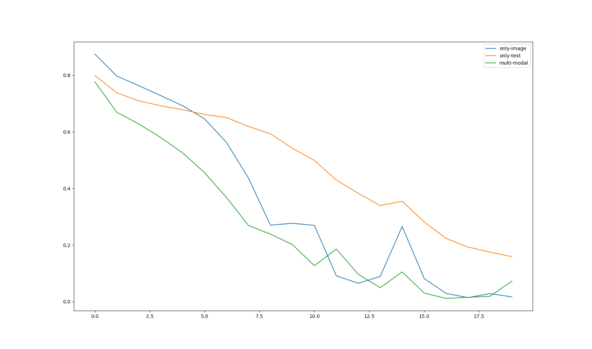
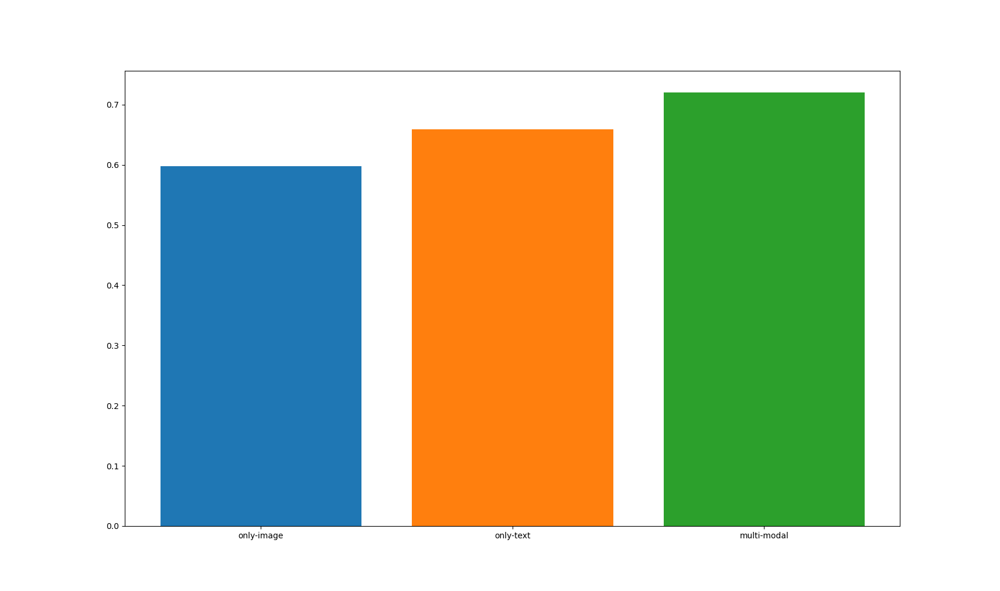

# 第五次实验报告

10205501401 | 杨天骥

## 简介

这次实验没做什么特别的事情, 所以报告就按照回答实验要求中问题的方式来写. 

仓库地址: https://github.com/Y-jiji/multi-modal-sentiment

## 遇到的BUG

开发过程中遇到的BUG主要是两个, 一个是随机数方面的, 就是torch设置了random seed过后实验出来还是有不一样的地方, 后来发现是dataset采样的时候调用的numpy随机数没有设定random seed, 设置后解决, 同一组参数做下来结果是完全相同的. 

另一个BUG是张量形状方面的, 我一直不太喜欢numpy和torch的auto broadcast这个特性就是因为它容易导致这类bug. 在将文本特征和图像特征融合的地方有一步加法, 此时图像特征的形状是(B, D), 而文本特征的形状是(B, 1, D)(因为是Decoder的输出), 然后两者相加就变成了大小为(B, B, D)的张量, 下一步Decoder就会看到同一个Batch当中其他的特征, **最致命的是程序还能跑起来, 导致这个问题一直发现不了.** 后来看训练误差实在不对一步步检查才发现. 

## 模型设计

首先基座模型使用Bert作为Encoder, 然后加上额外的一层Encoder得到一列文本特征S, 将S做平均作为初始的文本特征T0. 

将Resnet50提取出的图片特征先和文本特征TN进行融合, 然后和送入Decoder, 此时S作为Decoder的外部记忆, Decoder的输出记为T(N+1), 重复多次得到最终的特征. 将最终特征经过Linear+Softmax变成positive, neutral, negative三项的概率. 

**Decoder中再次加入文本特征作为外部记忆**的原因是图片信息和文本信息之间的关系可能也会影响文本的情感. 

## 验证集表现 + Ablation Study

这里采取留出法做验证, 随机取1/5的样本作为验证集. 

为了判断文本和图片各自的作用, 做一组消融实验. 为了在**不改变可训练参数量**的情况下进行实验, 这里only-image和only-text的实验分别是将Bert的输出和Resnet的输出置为零后进行训练得到的. 

训练中的交叉熵损失如下图所示. 

最终三个模型在验证集上得到的结果如下图所示, 发现融合特征相比只使用单个模态能提高模型的效果. 

